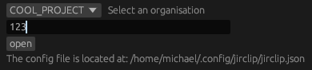

# jirclip
Open jira tickets quickly when someone only gives you the ticket id or only the number



## Use Cases
1. The application will look at your clipboard. If your clipboard starts with one of the defined "organisations" defined in the config. It will prefix your selected text with the "jira_prefix".
2. If there is no matching stuff in your clipboard. Then it will open a gui. Where you can select a organisation and enter its id.

## Configuration
``` json
{
  "organisations": ["COOL_PROJECT", "NICE_PROJECT"],
  "jira_prefix": "https://jira.copany.com/browse/{TICKET}"
}
```
